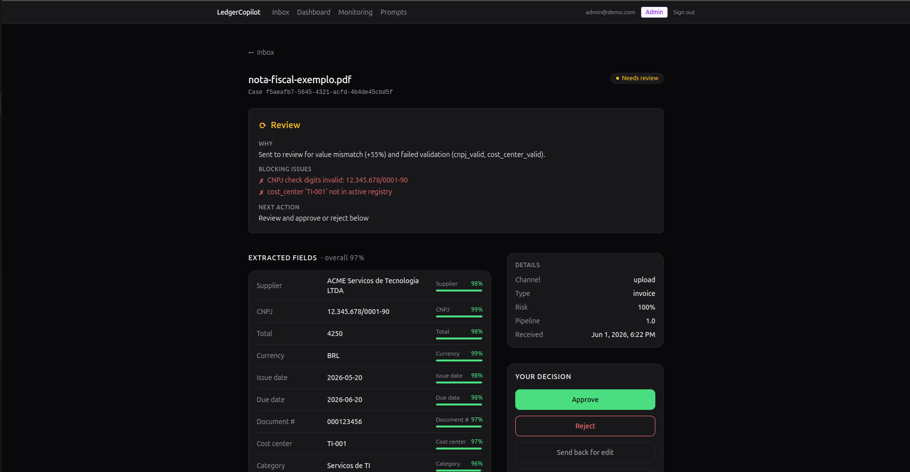
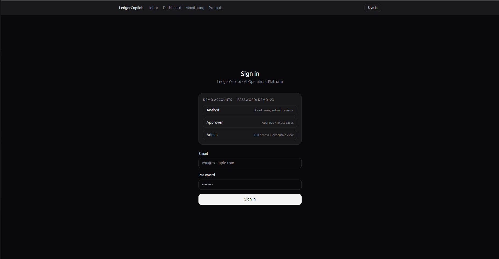
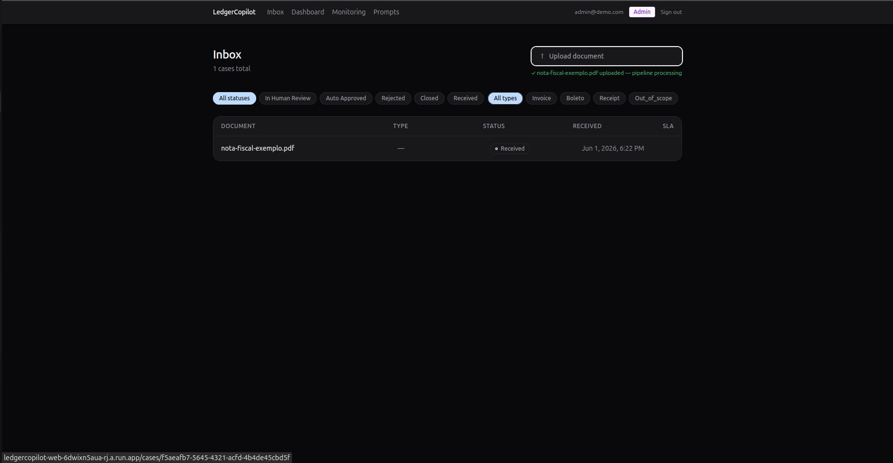
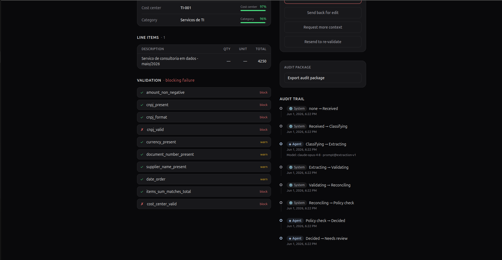
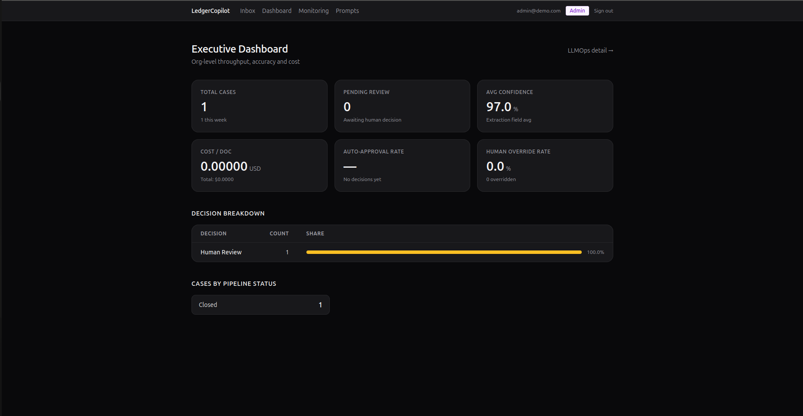
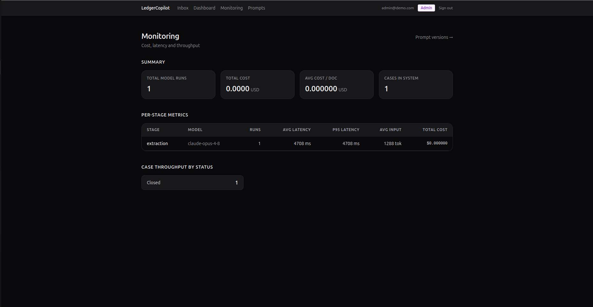
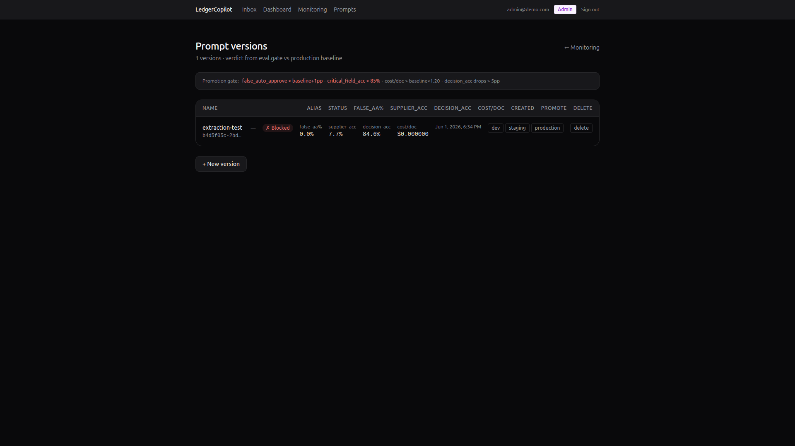
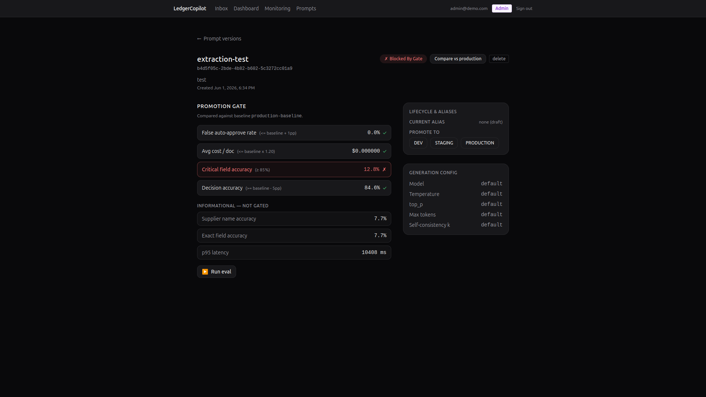
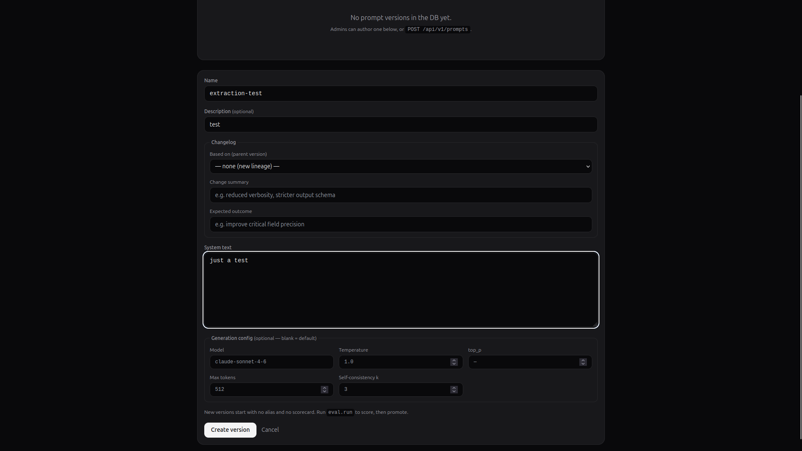

# LedgerCopilot

**LedgerCopilot is an AI operations platform for financial document workflows. It combines structured extraction, deterministic validation, policy enforcement, selective human review, and full audit trails to automate high-volume finance operations safely.**

Portuguese version: [`README.pt-BR.md`](./README.pt-BR.md).



---

## Problem

Finance teams drown in documents. Invoices (NF-e), boletos, and payment receipts arrive by email, ERP exports, spreadsheets, and shared folders. Someone opens each one, retypes the fields into a system, checks the CNPJ, compares the total against a purchase order, decides whether to pay, and files the result. The work is repetitive, error-prone, and invisible: when a wrong payment goes out, nobody can reconstruct who approved it or why.

Plain OCR does not solve this. It reads characters, but it does not decide. The hard part is not extraction, it is making a defensible operational decision on every document and keeping a record of it.

## What the product does

LedgerCopilot turns each incoming document into a **traceable case** that moves through a fixed pipeline:

```
classify → extract → validate → reconcile → apply policy → decide
```

Every case ends in one of three outcomes: `auto_approve`, `human_review`, or `reject`. Each outcome carries the evidence behind it: which fields were extracted, at what confidence, which validations passed or failed, which policy rules fired, and which model and prompt version produced the extraction.

What you get:

- **Multi-channel intake**: manual upload, email webhook, CSV/XLSX batch (one case per row), ERP/automation JSON, and a bucket-scan cron that picks up files dropped into storage.
- **Per-field extraction with confidence**: supplier, CNPJ, total, currency, issue and due dates, document number, line items, cost center, and category.
- **Deterministic validation**: amount sign, CNPJ presence/format/check-digits, date order, currency, sum-of-items vs total, cost-center membership against the org registry.
- **Versioned policy**: auto-approve limits, low-confidence routing, unknown-supplier checks, amount-vs-PO deltas, category justification, and dual-approval for urgent payments.
- **Reconciliation**: document against PO, against payment/ledger, against history (business-key dedup), plus a supplier blocklist hard-reject.
- **Selective human review**: only cases that genuinely need a human reach a queue, with five actions (approve, reject, edit, request more context, resend to an earlier stage).
- **Full audit trail**: every state transition writes an immutable `audit_event`, and approvers can export a complete audit package per case.

## Why it is not "just OCR + a chatbot"

A demo that pipes OCR text into a language model and asks it to "approve or reject" looks impressive and fails in production. LedgerCopilot is built around the opposite conviction: **the language model is the least trustworthy part of the system, so it gets the least authority.**

| "OCR + chatbot" | LedgerCopilot |
|---|---|
| The model decides | Deterministic code decides; the model only classifies and extracts |
| Numbers come from a probabilistic generation | CNPJ check-digits, item sums, and policy limits are pure functions |
| Document text becomes a prompt | Document content is untrusted input, sanitized before injection |
| Missing field gets a plausible guess | Missing field is `null` with confidence `0.0`, which forces review |
| "It worked in the demo" | Every change is scored on a dataset and gated before promotion |
| No record of why | Every transition is an immutable audit event |

Concretely, five principles are non-negotiable:

1. **Audit is the backbone, not a feature.** No case state changes without an `audit_event` in the same transaction.
2. **Determinism before the model.** Validation, dedup, CNPJ checks, totals, and policy are code, never a prompt.
3. **Human review prefers to escalate over guessing.** When in doubt, route to a human. Auto-approving something that should have been reviewed is the worst failure mode and is tracked as such.
4. **A document is untrusted data.** "Approve this" written inside an invoice is a prompt-injection signal, not a command.
5. **No invented values.** An illegible field stays empty. The system never fills in a plausible CNPJ or total.

## Architecture

A pnpm + uv monorepo. The decision logic is pure and testable without a database or network; all I/O lives at the edges.

```
apps/web/          Next.js (App Router): inbox, case detail, dashboard, monitoring, prompts
apps/api/          FastAPI: auth, cases, uploads, intake channels, prompts/policies
workers/           arq jobs: the document processing pipeline + bucket-scan cron
packages/domain/          Pydantic entities + state machine + decision logic (pure)
packages/validation/      deterministic validation engine (CNPJ, date order, sums, ...)
packages/policy/          policy engine + versioning
packages/reconciliation/  reconciliation engine
packages/agents/          extraction agent with Pydantic-validated output
packages/ai_gateway/      model abstraction, prompt registry, tracing, fallback, sanitization
eval/              dataset with slices, metrics, scorecards, promotion gate
migrations/        Alembic
infra/             IaC + docker-compose for local dev
```

| Layer | Choice |
|---|---|
| Frontend | Next.js (App Router) + TypeScript + Tailwind + shadcn/ui + Recharts |
| API | FastAPI + Pydantic v2 + SQLAlchemy 2.0 (async) |
| Workers | arq + Redis, with a migration path to Temporal for long-running human pauses |
| Database | Postgres for transactional state |
| Storage | GCS or S3 for files, Redis for queues |
| AI layer | Internal AI Gateway (abstracts model providers) + prompt registry + tracing + model fallback |
| Auth | JWT with role-based access control (analyst, approver, admin) |

`packages/{domain,validation,policy,reconciliation}` contain no SQLAlchemy and no model calls. That boundary is what makes the decision logic unit-testable and the audit trail trustworthy.

## End-to-end workflow

The worker runs every case through the same stages, emitting an audit event at each transition:

```
1. Document arrives (upload | email | bucket | csv/xlsx | API).
2. Case is created; hash, source, timestamps, and pipeline version are recorded.
3. OCR / parsing.
4. Classification + extraction (self-consistency k=3 on critical fields).
5. Validation engine (deterministic).
6. Policy engine (+ risk classification).
7. Reconciliation (vs PO / payment / ledger / history).
8. Decision: auto_approve | human_review | reject.
9. An audit_event is persisted on every transition.
10. Cost, latency, and token metrics are recorded per stage.
```

The state machine is explicit. An edited case re-enters at `extracted` and revalidates, so a human correction never bypasses the deterministic checks:

```
received → classified → extracted → validated → reconciled → policy_evaluated → decided
   decided ─┬─ auto_approved → closed
            ├─ rejected → closed
            └─ in_human_review ─┬─ approved → closed
                                ├─ rejected → closed
                                └─ edited → (back to extracted, revalidate)
```

## Human-in-the-loop design

The review queue is the center of the product, and it is deliberately small. Healthy cases stay quiet; only cases that need a decision surface.

When a case lands in review, the analyst sees the reasoning, not raw model output:

- **Why** the case was escalated, in plain language ("value mismatch (+55%) and failed validation").
- **Blocking issues** listed explicitly (for example, "CNPJ check digits invalid" and "cost_center not in active registry").
- **Extracted fields** with per-field confidence bars.
- **Validation results** marked `block` or `warn`.
- **The full audit trail**, showing which actor (system, agent, human) drove each transition and under which model and prompt version.

Five actions are available, scoped by role:

| Action | Effect |
|---|---|
| Approve | Close the case as approved (approver/admin) |
| Reject | Close the case as rejected (approver/admin) |
| Edit | Correct fields and re-enqueue from `validated` (analyst+) |
| Request more context | Add an annotation without changing status |
| Resend to stage | Re-enter the resumable pipeline at `extracted` or `validated` |

Roles are enforced on every endpoint and queries are organization-scoped. Approvers and admins can export a per-case audit package.

## LLMOps and governance

The AI layer is treated like production software: versioned, traced, measured, and gated.

- **Prompt registry.** Prompts are not inlined in code. Each version has `dev`/`staging`/`production` aliases and is referenced by `prompt_version_id`. Promoting to `production` wires the new system text directly into the pipeline worker.
- **Tracing.** Every model call passes through the AI Gateway and records tokens, latency, cost, stage, model, and a redacted prompt/completion. Sensitive PII never reaches traces in the clear.
- **Evaluation dataset.** Slices cover the failure modes that matter: `clean_invoice`, `low_quality_scan`, `handwritten_receipt`, `duplicate_invoice`, `adversarial_formatting`, `supplier_unknown`, `value_mismatch`, `language_variation`.
- **Promotion gate.** `eval.gate` blocks a promotion (exit code 1) when any rule is violated: `false_auto_approve_rate > baseline + 1pp`, `critical_field_accuracy < 85%`, `cost/doc > baseline × 1.20`, or `decision_accuracy` dropping more than 5pp. The same rules guard `POST /api/v1/prompts/{id}/promote`.

A draft prompt that fails the gate cannot reach production, and the UI shows exactly which metric blocked it (see the screenshots below).

## Screenshots

**Sign in with seeded demo roles (analyst, approver, admin).**



**Inbox: every document becomes a case with status, type, and SLA.**



**Case review: the "why", blocking issues, per-field confidence, and the decision panel.**


**Deterministic validation and the immutable audit trail on the same case.**



**Executive dashboard: throughput, average confidence, cost per document, decision mix.**



**Monitoring: per-stage model runs, latency, tokens, and cost.**



**Prompt versions with their scorecard, gated against the production baseline.**



**Promotion blocked: critical field accuracy below threshold fails the gate.**



**Authoring a new prompt version with generation config and self-consistency k.**



## Dataset and evaluation

The dataset is organized by slice, where each slice targets a specific failure mode rather than a happy path. The metrics that drive promotion decisions are:

- exact and normalized field accuracy
- `missing_critical_fields_rate`
- **`false_auto_approve_rate`** (the metric the whole design optimizes against)
- exception routing precision
- human correction rate
- cost per document and p95 latency

Critical fields (`total_amount`, `tax_id_cnpj`, `document_number`) go through self-consistency k=3 and weigh into `overall_confidence`. `supplier_name_accuracy` is reported but intentionally not gated, since supplier name is not a critical field.

Run an evaluation and gate a candidate against production:

```bash
# Score a prompt version across all slices and write a scorecard
uv run python -m eval.run --prompt-version dev --out eval/scorecards/candidate.json

# Compare against the production baseline (exit 1 = blocked)
uv run python -m eval.gate \
    --candidate eval/scorecards/candidate.json \
    --baseline  eval/scorecards/production.json
```

A blocked promotion looks like this:

```
=== eval.gate: extraction-v2-experimental vs extraction-v1 ===

  PROMOTION BLOCKED for extraction-v2-experimental:

  ✗ false_auto_approve_rate: 0.025 > 0.000+0.01
  ✗ critical_field_accuracy: 0.000 < 0.85
  ✗ decision_accuracy: 0.625 < 0.700 (baseline-0.05)

Exit code: 1
```

The dataset currently ships one fixture per slice, which is enough to demonstrate the gate end to end. Expanding it is the obvious next step for statistical significance.

## Trade-offs

Every design choice here has a cost, and naming it is part of the point.

- **Determinism over flexibility.** Putting CNPJ checks, sums, and policy in code makes the system predictable and auditable, but it means new rules require a code change and a migration, not a prompt edit. That is intentional: rules that move money should not live in a prompt.
- **Escalation over automation rate.** Preferring `human_review` when in doubt keeps `false_auto_approve_rate` low at the cost of a lower auto-approval rate. For finance operations, a missed review is far more expensive than an extra one.
- **arq + Redis over Temporal, for now.** arq covers the current pipeline cleanly. Long-running workflows with multi-day human pauses will need Temporal; the architecture leaves room for that migration without rewriting the domain logic.
- **Synchronous-feeling pipeline over event sourcing everywhere.** The audit log gives lineage without the full operational weight of an event-sourced system. If reconciliation grows more complex, that boundary may need to move.
- **One fixture per slice over a large benchmark.** This proves the LLMOps loop works, not that the model is production-accurate. The dataset is the first thing to grow before a real deployment.

## Roadmap

The product was built in four phases, each gated by a concrete success criterion.

| Phase | Scope | Status |
|---|---|---|
| 1. Core MVP | Upload, classification, extraction, validation, case detail, review queue, audit events | Complete |
| 2. Workflow intelligence | Policy engine, per-field confidence, approve/reject/edit, reconciliation | Complete |
| 3. LLMOps layer | Eval framework, gate CLI, scorecards, prompt registry wired to runtime, tracing | Complete |
| 4. Enterprise polish | JWT + RBAC, org-scoped queries, dashboards, audit export, all five intake channels | Complete |

Next, in priority order:

- Expand the evaluation dataset beyond one fixture per slice.
- Migrate long-running, human-paused workflows to Temporal.
- Deepen reconciliation against real ERP reference data.
- Add the conversational review assistant (ask "why was this escalated?" and get a traceable answer).

---

## Getting started

Requirements: Python 3.12+, Node 20+, `uv`, `pnpm`, Docker.

```bash
corepack enable pnpm        # if not already enabled

uv sync                     # Python deps
pnpm install                # frontend deps

docker compose -f infra/docker-compose.dev.yml up -d   # postgres + redis + storage
uv run alembic upgrade head                            # migrations
```

Run the three processes:

```bash
uv run uvicorn apps.api.main:app --reload     # API at :8000
uv run arq workers.pipeline.WorkerSettings    # pipeline worker
pnpm --filter web dev                         # frontend at :3000
```

Quality gates (run before considering a task done):

```bash
make check      # ruff + mypy + pytest + web lint/typecheck
```

### Demo accounts

Three users are seeded at API startup (password `demo123`):

| Email | Role | Permissions |
|---|---|---|
| `analyst@demo.com` | analyst | Read cases, submit edit reviews |
| `approver@demo.com` | approver | Analyst access + approve/reject + audit export |
| `admin@demo.com` | admin | Full access + create/promote prompts + dashboard |

```bash
# Login and capture a JWT
TOKEN=$(curl -s -X POST http://localhost:8000/api/v1/auth/login \
  -H "Content-Type: application/json" \
  -d '{"email":"admin@demo.com","password":"demo123"}' | jq -r .access_token)

# Upload a document
curl -s -X POST http://localhost:8000/api/v1/documents \
  -H "Authorization: Bearer $TOKEN" \
  -F "file=@/path/to/invoice.pdf"

# List cases (organization-scoped)
curl -s -H "Authorization: Bearer $TOKEN" http://localhost:8000/api/v1/cases
```
